# NutriScan Calorie Tracker - Detailed Technical Specifications (AGENTS.detail.md)

This document provides deep technical details, schemas, and protocol flows for key features of the **NutriScan Calorie Tracker** codebase. Refer to these details when modifying database engines, data sync formats, settings, or platform-specific builds.

---

## 1. Database Backup, Restore, & File Downloading Specifications

### Cross-Platform File Saving & Export (Images, Databases, Reports)
To ensure seamless, crash-free file exporting (e.g. SQLite database copies, downloaded images, PDF reports) across different operating systems, follow this platform logic:

- **Desktop (Windows, macOS, Linux)**:
  - Always use `getSaveLocation()` from `package:file_selector` to open a native file picker dialogue.
  - Require user to select the destination, then write the bytes directly.

- **Mobile (Android)**:
  - Do NOT call `getSaveLocation()`, which throws `UnimplementedError` on Android.
  - Implement a three-stage automated fallback flow:
    1. **Public Download Folder**: Try `/storage/emulated/0/Download/` first. If folder exists and is writable, save the file there so it is easily accessible.
    2. **App External Storage Fallback**: If public write fails or folder is restricted, use `getExternalStorageDirectory()` (resolves to `/storage/emulated/0/Android/data/<package_name>/files/`). This requires zero permissions.
    3. **App Document Sandbox Fallback**: If external storage is missing or unmounted, fallback to the secure `getApplicationDocumentsDirectory()` folder.
  - **Notification Placement**: Never show `ScaffoldMessenger` snackbars inside dialogs (as they render behind the active dialog in the page's route). Display an auto-dismissing, elegant overlay `Dialog` centered on screen with `barrierColor: Colors.black26`.

### Native SQLite Database Export
- **Path to Copy**: Defined in `DbHelper.exportDatabase({required String destPath})`. Retrieves the active SQLite database path and uses Dart's `File(src).copy(destPath)` to copy the live SQLite file.

### Native SQLite Database Restore
- **Backend Flow**: Implemented in `DbHelper.restoreDatabase({required String backupPath})`.
  1. Closes the active database connection if open (`_database?.close()`).
  2. Discards the current `_database` instance cached in memory.
  3. Locates the default database location using `getApplicationSupportDirectory()`.
  4. Overwrites the live database file with the file specified by `backupPath`.
  5. Re-opens and runs migrations to return a valid active database handle.
- **Platform-Specific UI Selection**:
  - **Desktop (Windows, macOS, Linux)**: Opens native file picker restricted to `.db` files using `openFile()` from `package:file_selector`.
  - **Mobile (Android)**: Scans the external storage directory (`getExternalStorageDirectory()`) or fallback app documents directory for database backups matching the pattern `nutriscan_db_*.db`. Displays a sorted list in a dialog for selection.

---

## 2. JSON Import/Export Format & Rules

To facilitate direct cross-platform backup sharing and manual data transfer, the app supports exporting and importing meal logs formatted as a single JSON file.

### Payload Variants
During import, the parser dynamically accepts three shapes:
1. **Full Envelope (Standard Export)**: Contains configuration goals (ignored during import) and an array of meals.
2. **Raw Array**: A JSON list containing 1 to N meal objects.
3. **Single Entry**: A single JSON meal object.

### Image Serialization
Images are serialized as standard **RFC 2397 Data URIs** inside the JSON `image` field.
- **Format**: `data:[<mediatype>][;base64],<data>`
- **Supported types**: `image/jpeg`, `image/png`, `image/webp`.

### Unique Identifiers & Deduplication
- **Stable ID**: The `shortId` field serves as the stable identifier for deduplication (e.g. `MEAL-K9J8H7G6F`).
- **Auto-Generation**: If a meal lacks a `shortId` on import, one is dynamically generated matching `^MEAL-[A-Z0-9]{9}$`.
- **Collision Resolution**: If an imported meal's `shortId` already exists locally, the local SQLite row is overwritten/updated (preserving the internal auto-increment primary integer `id` key of the SQLite database).

---

## 3. Bidirectional Cloud Synchronization

The app integrates an optimized bidirectional sync architecture with a Bun-based HTTP cloud server. This system avoids transferring redundant files or duplicate payloads.

### SQLite Schema Tracking
Two integer flags in the `meals` SQLite table track local state changes:
- `synced`: Set to `0` when a meal is created or updated locally. Flips to `1` when successfully synced with the cloud.
- `deleted`: Set to `1` when a meal is deleted locally. Remains in SQLite to let the sync service notify the server of deletion, then gets permanently removed from local SQLite after successful server sync.

### Sync Service Protocol (`SyncService.sync`)
Synchronization is executed asynchronously inside `AppState` in 9 structured steps:

```mermaid
sequenceDiagram
    participant AppState as AppState/SyncService
    participant Server as Bun Cloud Server
    
    rect rgb(22, 31, 48)
    Note over AppState,Server: Phase 1: Handshake & Metadata
    AppState->>Server: 1. GET /api/sync/ping
    Server-->>AppState: 200 OK (Backend Available)
    AppState->>Server: 2. GET /api/sync/{toolId}/metadata
    Server-->>AppState: JSON metadata (ID, updatedAt, deleted)
    end
    
    rect rgb(30, 41, 59)
    Note over AppState,Server: Phase 2: Resolve Deletions & Delta Pulls
    AppState->>AppState: 3. Fetch local SQLite records (active + deleted)
    AppState->>AppState: 4. Identify changed records & apply server deletions
    AppState->>Server: 5. POST /api/sync/{toolId}/pull {ids: [...]}
    Server-->>AppState: JSON full delta records
    AppState->>AppState: 6. Merge pulled records to local SQLite
    end
    
    rect rgb(16, 185, 129)
    Note over AppState,Server: Phase 3: Push Delta Changes
    AppState->>Server: 7. POST /api/sync/{toolId} {records: [...]}
    Server-->>AppState: 200 success=true
    AppState->>AppState: 8. Finalize local SQLite statuses (synced=1, erase deleted)
    AppState->>AppState: 9. Reload meals list & notify UI listeners
    end
```



---

## 4. Multi-Language & Localization

### String Management
- Use `AppLocalizations.of(context)!` for user-facing strings.
- Target files: `lib/l10n/app_en.arb` and `lib/l10n/app_de.arb`.
- Key command: `flutter gen-l10n` regenerates classes.

### Date Formatting
- Date formatters must pass explicit context-driven locales:
  ```dart
  final locale = Localizations.localeOf(context).toLanguageTag();
  DateFormat('MMM d, yyyy', locale).format(dateTime);
  ```

### Dropdown Switcher
- Controlled inside `LanguageCard` (`lib/widgets/settings/language_card.dart`). Updates state via `AppState.setLocale(code)`.

---

## 5. Tab Navigation & State Rules

- `selectedTabIndex` is managed within `AppState` in `lib/providers/app_state.dart`.
- Scan success navigation triggers `AppState.selectTab(0)` to switch focus back to Dashboard.
- Screen layouts bind to index updates inside `ResponsiveLayout`.

---

## 6. Input Validation Specifications

- Numeric constraints on macro text fields: enforced via `FilteringTextInputFormatter.digitsOnly`.
- Scan date selection: defaults to today, allows retro-active date assignment in the past.

---

## 7. Icon Generation & Assets

- **Source Asset**: `assets/logo/logo.png`.
- **Android Launcher Icon Generation**: Configured in `pubspec.yaml` under `flutter_launcher_icons:`. Generate using:
  ```bash
  flutter pub run flutter_launcher_icons
  ```
- **Windows Executable Icon**: Located at `windows/runner/resources/app_icon.ico`. Custom multi-resolution packaging (16x16 to 256x256).

---

## 8. Windows Desktop OS Specifics

- Path resolving in MSYS2 environment (backslashes vs front slashes).
- Dynamic FFI initialization (`sqfliteFfiInit()`) inside `lib/helpers/db_helper.dart`.
- Local app data directory retrieval via `getApplicationSupportDirectory()`.
